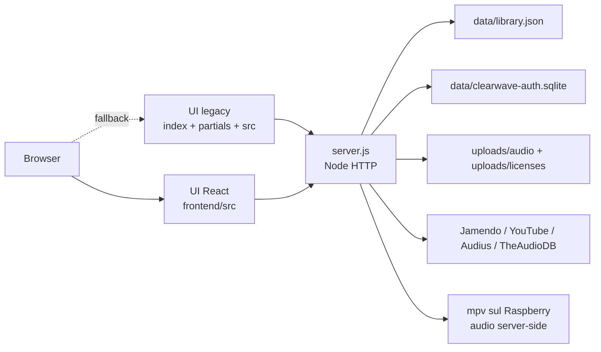

# Architettura ClearWave

ClearWave e' una web app locale per cercare, importare, verificare e riprodurre musica usabile in contesti commerciali. Il progetto e' composto da un backend Node senza framework, una UI React principale e una UI legacy tenuta come fallback storico.

## Vista generale

## Backend

File principale: `server.js`.

Il backend gestisce:

- routing HTTP;
- API JSON sotto `/api/...`;
- autenticazione e ruoli;
- catalogo musicale;
- upload locali;
- proxy/redirect media;
- import da provider;
- player server-side per Raspberry tramite `mpv`;
- generazione preview WAV;
- rendering HTML legacy con partial;
- serving della build React.

Non usa Express o altri framework. La funzione centrale e' `requestHandler(req, res)`.

## Storage

| Percorso | Tipo | Descrizione |
| --- | --- | --- |
| `data/library.json` | JSON | Catalogo permanente dei brani importati o caricati. |
| `data/clearwave-auth.sqlite` | SQLite | Utenti, ruoli, hash password e flag cambio password. |
| `data/youtube-import-state.json` | JSON | Stato progressivo per import YouTube a lotti. |
| `uploads/audio/` | File runtime | Audio caricati manualmente. |
| `uploads/licenses/` | File runtime | Licenze, ricevute e prove diritti. |
| `assets/covers/` | Asset statici | Copertine locali/fallback per generi. |
| `frontend/dist/` | Build generata | Bundle React prodotto da Vite. |

I file runtime sono esclusi da git. Il codice deve funzionare anche quando non esistono ancora: `ensureStorage()` prepara cartelle e file iniziali.

## Autenticazione

L'autenticazione e' locale.

1. `ensureAuthDatabase()` crea la tabella `users` se manca.
2. Se non esistono utenti, crea l'admin iniziale.
3. `POST /api/auth/login` verifica username/password.
4. Le password sono hashate con PBKDF2 e salt.
5. Il backend crea un token random e lo salva in memoria in `authSessions`.
6. Il frontend passa il token con `Authorization: Bearer <token>`.
7. Al riavvio del server le sessioni in memoria spariscono e bisogna rifare login.

Ruoli:

- `admin`: puo' gestire utenti, importare, caricare e cancellare brani;
- `user`: puo' usare catalogo e player, ma non modificare dati sensibili.

## Gestione utenti

Gli utenti vivono in SQLite. I campi pubblici vengono filtrati da `publicUser()`, quindi il frontend non riceve mai `password_hash`.

Azioni principali:

- `createAuthUser(payload)`: crea utente/admin con password temporanea;
- `resetAuthUserPassword(req, username)`: rigenera password temporanea e invalida sessioni dell'utente;
- `deleteAuthUser(req, username)`: elimina un utente e invalida sessioni;
- `changeAuthPassword(req, payload)`: cambia password dell'utente loggato.

Regole di sicurezza:

- non si puo' eliminare l'utente collegato;
- deve restare almeno un admin;
- il reset password non puo' essere usato sulla propria utenza;
- un utente resettato deve cambiare password al login successivo.

## Catalogo

Il catalogo e' letto da `readLibrary()` e scritto con `writeLibrary(tracks)`.

Ogni traccia viene normalizzata con:

- `normalizeTrack(track)`;
- `attachComputedFields(track)`;
- `providerOriginalCoverPath(track)`;
- `artworkForGenre(genre)`;
- `previewPath` e `downloadPath`.

Il frontend non deve indovinare percorsi o fallback: usa i campi gia' calcolati dal backend.

## Media e player

Il backend espone:

- `/api/tracks/:id/preview.wav`;
- `/api/tracks/:id/download`;
- `/api/server-player/status`;
- `/api/server-player/play`;
- `/api/server-player/pause`;
- `/api/server-player/seek`;
- `/api/server-player/volume`;
- `/api/server-player/stop`;
- `/api/covers/jamendo/:trackId.jpg`;
- `/api/providers/audius/:id/stream`;
- `/uploads/...`;
- `/assets/...`.

Il player React ha due uscite:

1. `Pi`: il browser manda comandi API e `server.js` avvia `mpv` sul Raspberry;
2. `PC`: fallback browser con audio tag o iframe YouTube.

Il backend sceglie la sorgente migliore:

1. audio locale o stream diretto;
2. URL YouTube passato a `mpv`/`yt-dlp` quando l'uscita e' `Pi`;
3. embed YouTube quando l'uscita e' `PC`;
4. preview WAV generata.

La preview WAV e' pensata come fallback tecnico, non come sostituto di un master musicale reale.

## Discovery e import

I provider vengono dichiarati da `buildDiscoveryProviders()` e filtrati da `publicDiscoveryProviders(rightsMode)`.

Provider principali:

| Provider | Uso |
| --- | --- |
| Jamendo | Ricerca e import con stream audio diretto. |
| YouTube whitelist | Ricerca/import da canali consentiti, riproduzione via embed. |
| Audius | Ricerca e proxy stream, da usare solo con verifica licenza. |
| TheAudioDB | Metadata/immagini, non audio commercial-safe. |

Flusso:

1. La UI chiede provider disponibili.
2. L'admin cerca con provider, query, limite e modalita' diritti.
3. Il backend chiama API esterne.
4. Ogni risultato viene mappato in un formato comune.
5. L'import salva solo brani riproducibili e deduplicati.

## Import YouTube

YouTube e' trattato con cautela:

- la Data API non consente download audio;
- i risultati vengono riprodotti con iframe embed;
- i canali principali sono whitelist;
- lo stato import progressivo viene salvato in `youtube-import-state.json`;
- quando la quota finisce, l'import puo' riprendere dal punto salvato.

## UI legacy

URL fallback: `http://localhost:3000/legacy`.

E' la UI storica usata come riferimento e fallback. Usa:

- `index.html` come template;
- `partials/` per blocchi HTML;
- `src/` per logica browser;
- `styles/` per temi e layout.

Il backend renderizza gli include `@include` con `renderHtmlTemplate()`.

La UI legacy copre:

- login;
- catalogo;
- preferiti;
- coda;
- playlist automatiche;
- discovery e import;
- upload;
- report;
- archivio;
- compliance;
- player globale.

## UI React

URL sviluppo: `http://localhost:5173`.

URL build principale: `http://localhost:3000`.

URL build alias: `http://localhost:3000/react/`.

La UI React usa le stesse API del backend. Non ha storage separato lato server.

Responsabilita' attuali:

- login e token;
- catalogo;
- filtri;
- coda;
- player con seek, volume, shuffle e repeat;
- selettore audio `Pi/PC`, con `Pi` pensato per la produzione su Raspberry;
- gestione utenti admin;
- import sicuro e playlist temporanea admin;
- upload e archivio licenze;
- cambio password;
- tema dark/light.

`App.jsx` mantiene lo stato globale. I componenti sotto `frontend/src/components/` ricevono props e rimangono focalizzati sulla UI.

## Routing statico

Il backend serve:

- `/` e `/index.html`: build React principale;
- `/react/`: build React, alias compatibile;
- `/legacy`: UI legacy di fallback;
- `/assets/...`: asset statici;
- `/styles/...`: CSS legacy;
- `/src/...`: JS legacy;
- `/uploads/...`: file caricati;
- `/api/...`: API JSON o media dinamici.

La risoluzione percorsi usa controlli per evitare accessi fuori dalle cartelle consentite.

## Confini importanti

- Le chiavi API stanno solo in variabili ambiente o `start-local.ps1`.
- Il browser non deve contenere segreti.
- `data/` e `uploads/` sono runtime, non codice.
- React e legacy possono convivere finche' la migrazione non e' completa.
- Le API admin devono sempre chiamare `requireAdminRequest(req)`.
- Ogni nuovo endpoint va documentato in `docs/ENDPOINT_API.md`.
